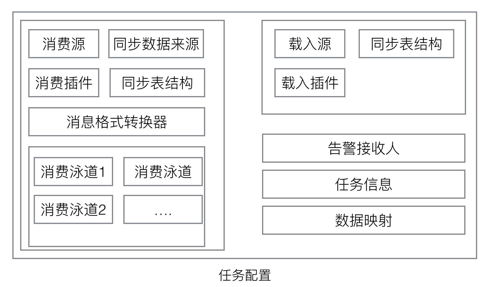

# Configuration document
## compatibility
```
	compatible v0.3.2+，include v0.3.2
```
<!--
## 结构

-->
## Document structure

- config/application.properties

```
	Spring-boot configuration file, configurable running environment (spring.profiles.active), etc. For details, please refer to the spring-boot official documentation.
	The above parameters can also be specified via the startup.sh script, for example: startup.sh --logging.level.root=debug
```

- config/application-${env}.properties

```
	Spring-boot configuration file, configuration files for different runtime environments.
```


- config/tasks/${env}/*.properties

```
	Task configuration file
	Tasks for different environments (${env}) are configured in different subdirectories of the config/tasks directory.
```


- Log generation directory

```
	spring-boot configuration parameters，default : logging.file=${app.home}/logs/data-porter.log.
	${app.home} is specified in the startup script and refers to the root directory of datas-porter.
```

## Node number

- porter.id

```
	Used to specify the task node number, which is unique in the distributed environment. Used to self-describe and report heartbeats on zookeeper to implement distributed locks.
	eg.
		porter.id=100
```


## Statistic
- porter.statistic.upload

```
	Whether to upload statistics, including logs, TPS indicators.
	Type : Boolean
```

 
## Cluster
### porter.cluster

```
	Distributed cluster implementation, currently only supports zookeeper
```


- porter.cluster.strategy

```
	Specify the implementation strategy of the distributed cluster.
	eg.
		porter.cluster.strategy=ZOOKEEPER
```

- porter.cluster.client.url

```
	Cluster connection parameters.
	eg.
		porter.cluster.client.url=127.0.0.1:2181
```

- porter.cluster.client.sessionTimeout

```
	Cluster connection timeout
	eg.
		porter.cluster.client.sessionTimeout=overtime time, in milliseconds.
```

## Alert
### porter.alert

```
 	Alarm policy driver, currently only supports mail.
```

- porter.alert.strategy

```
	Specify the alarm mode
	eg.
		porter.alert.strategy=EMAIL
```

- porter.alert.frequencyOfSeconds

```
	Same content notification receiving frequency.
	eg.
		porter.alert.frequencyOfSeconds=60
```

- porter.alert.client

```
	porter.alert.client.host=smtp server
	porter.alert.client.username=mail address
	porter.alert.client.password=password
	porter.alert.client.smtpAuth=true
	porter.alert.client.smtpStarttlsEnable=true
	porter.alert.client.smtpStarttlsRequired=false
```

- porter.alert.receiver

```
	Global alarm informer
	Type ：ArrayList
	porter.alert.receiver[index].realName=name
	porter.alert.receiver[index].email=mail address
	porter.alert.receiver[index].phone=phone number
```

## Public connection pool

```
	Configured when multiple task targets and sources share a database connection pool to save database link resources.
	Type : Map
	
```


### porter.source.Named name
- porter.source.Named name.sourceType

```
	Source type
	Type : enum
	Optional parameter : JDBC
```


- porter.source.Name name.url

```
	Multiple separated by ","
	eg.
		porter.source.Named name.url=jdbc link
```

- porter.source.Named name.userName

```
	account name
	eg.
		porter.source.命名名字.userName=account name
```

- porter.source.Named name.password

```
	password
	eg.
		porter.source.Named name.password=password
```

- porter.source.Named name.maxWait
- porter.source.Named name.minPoolSize
- porter.source.Named name.maxPoolSize
- porter.source.Named name.initialPoolSize
- porter.source.Named name.connectionErrorRetryAttempts

```
	Connection error retries
	Type : Int
```
[//]: # (todo)
- porter.source.Named name.dbType

```
	Type : Enum
	Optional parameters : MYSQL、		ORACLE
```

- porter.source.Connection error retries.makePrimaryKeyWhenNo(<font color='red'>2.0.1 add</font>)

```
	Type : Boolean
	When the target table has no primary key, the default all fields are primary keys.
	default : true
```


## Task configuration
###  porter.task
```
	Node task
	Type : ArrayList
```

- porter.task[index].taskId

```
	Task number
	Type : String
	eg. 
		porter.task[index].taskId=1
```

- porter.task[index].receiver

```
	Current task alarm informer
	Task alert will be notified : porter.task[index].receiver + porter.alert.receiver
	Type ：ArrayList
	porter.task[index].receiver[index].realName=name
	porter.task[index].receiver[index].email=mail address
	porter.task[index].receiver[index].phone=phone number
```

- porter.task[index].consumer

```
	Task consumption source configuration
	Type : DataConsumerConfig
```	

- porter.task[index].consumer.consumerNameme	

```
		Consumer plugin
		Type : String
		Optional parameter : CanalFetch、KafkaFetch
```

- porter.task[index].consumer.converter

```
		Message converter
		Type : String
		Optional parameter : canalRow(1.0 add)、oggJson
```

- porter.task[index].consumer.source

```
	Consumer data source
	Type : Map
	
	CanalFetch：(1.0 add)
	porter.task[index].consumer.source.sourceType=CANAL
	porter.task[index].consumer.source.slaveId=mysql slaveId
	porter.task[index].consumer.source.address=ip:port
	porter.task[index].consumer.source.database=database
	porter.task[index].consumer.source.username=account
	porter.task[index].consumer.source.password=password
	porter.task[index].consumer.source.filter=Subscription form regular
	
	KafkaFetch:
	porter.task[0].consumer.source.sourceType=KAFKA
	porter.task[0].consumer.source.servers=ip:port,ip:port
	porter.task[0].consumer.source.topics=topic
	porter.task[0].consumer.source.group=Consumer group
	porter.task[0].consumer.source.autoCommit=true|false
	
```

- porter.task[index].consumer.metaSource


```
	Metadata data source
	Type : Map
	When the configuration is not done, the data between the source and the target will not be compared.(1.1 new rule)
	Form 1：
	porter.task[index].consumer.metaSource.sourceName=public data source name
	
    Form 2:
	porter.task[index].consumer.metaSource.dbType
	porter.task[index].consumer.metaSource.url
	porter.task[index].consumer.metaSource.userName
	porter.task[index].consumer.metaSource.password
	porter.task[index].consumer.metaSource.maxWait
	porter.task[index].consumer.metaSource.minPoolSize
	porter.task[index].consumer.metaSource.maxPoolSize
	porter.task[index].consumer.metaSource.initialPoolSize
	porter.task[index].consumer.metaSource.connectionErrorRetryAttempts
```

- porter.task[index].consumer.eventProcessor.className(1.1 add)

```
	Custom sync data data extractor
	Format : package.className
```

- porter.task[index].consumer.eventProcessor.content(1.1 add)

```
	class path、jar path、Source content
```
- porter.task[index].consumer.eventProcessor.emptyFetchNoticeSpan(<font color='red'>2.0.1 add</font>)

```
	Empty query notification interval, in seconds.
	default : 3600
```

- porter.task[index].consumer.eventProcessor.emptyFetchThreshold(<font color='red'>2.0.1 add</font>)

```
	Empty query notification time threshold, in seconds
	-1 does not take effect, default 3600
```


- porter.task[index].loader

```
	Task loader configuration
	Type : DataLoaderConfig
```

- porter.task[index].loader.loaderName

```
	Target loader plugin
	Type : Enum
	Optional parameter : JdbcBatch、JdbcSingle
```	

- porter.task[index].loader.source


```
	Target data source
	Type : Map
	
	Form 1：
	porter.task[index].loader.source.sourceName=public data source name
	
	Form 2:
	porter.task[index].loader.source.dbType
	porter.task[index].loader.source.url
	porter.task[index].loader.sourceuserName
	porter.task[index].loader.source.password
	porter.task[index].loader.source.maxWait
	porter.task[index].loader.source.minPoolSize
	porter.task[index].loader.source.maxPoolSize
	porter.task[index].loader.source.initialPoolSize
	porter.task[index].loader.source.connectionErrorRetryAttempts
```

- porter.task[index].loader.insertOnUpdateError(<font color='red'>2.0 add</font>)

```
	The target end update fails to insert the switch parameter, default enabled.
	Type : Boolean
```

- porter.task[index].mapper

```
	Source and destination schema mapping, used to handle the inconsistency between source and destination naming.
	Type : List
```

- porter.task[index].mapper[subscript].schema

```
	porter.task[index].mapper[index].schema=source schema,target schema
```

- porter.task[index].mapper[subscript].table

```
	porter.task[index].mapper[index].table=source table name, target table name
```


- porter.task[index].mapper[subscript].updateDate

```
	Data synchronization result check function is not enabled if it is not configured or configured incorrectly.
	porter.task[index].mapper[subscript].updateDate=The source table automatically updates the time field, and the target table automatically updates the time field.
```

- porter.task[index].mapper[subscript].column

```
	Field mapping, no need to configure.
	porter.task[index].mapper[subscript].column.Source field name = target field name
```
	